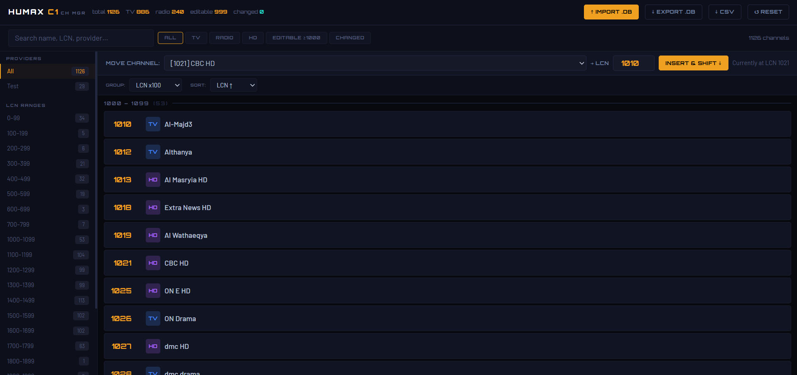

# Humax C1 Channel Manager

> A modern web app for importing, reorganizing, and exporting **Humax C1 `.db` channel backup files** — no technical knowledge required.



---

## Overview

Humax C1 Channel Manager gives you a clean, fast UI to work with the `.db` backup files produced by the **Humax C1 satellite receiver**. These files store your channel list in a compressed, binary-wrapped JSON format. This tool handles all the parsing, lets you rearrange channels freely, and writes back a valid `.db` file that your receiver can restore.

---

## Features

| Feature | Description |
|---|---|
| 📥 **Import `.db`** | Drag-and-drop or click to import your Humax `.db` backup |
| 🔓 **Auto-decompress** | Uses `pako` to inflate the gzip-compressed payload automatically |
| 📺 **Browse channels** | View all 1000+ channels sorted by LCN with TV / Radio / HD badges |
| 🔍 **Search & filter** | Filter by name, LCN, provider, type (TV / Radio / HD), editable, or changed |
| 🗂️ **Provider sidebar** | Jump to channels grouped by satellite provider |
| 📏 **LCN range nav** | Quickly navigate to LCN ranges (0–99, 100–199, …) |
| ✏️ **Edit LCN** | Inline editing of LCN values for editable channels (LCN ≥ 1000) |
| 🔀 **Move & insert** | Move a channel to any LCN position with automatic shifting |
| 📤 **Export `.db`** | Download a patched `.db` ready to restore on your receiver |
| 📄 **Export CSV** | Export the full channel list as a spreadsheet-friendly CSV |
| 🔄 **Reset** | Undo all changes and revert to the originally imported state |

---

## Screenshot


The toolbar at the top shows **total / TV / radio / editable / changed** counts at a glance. The left sidebar lets you filter by **provider** or **LCN range**. The main panel shows channels grouped and sorted, with the **Move Channel** bar for precise repositioning.

---

## Tech Stack

| Layer | Technology |
|---|---|
| UI Framework | [React 19](https://react.dev) |
| Language | [TypeScript 6](https://www.typescriptlang.org) |
| Build Tool | [Vite 8](https://vite.dev) |
| Styling | [Tailwind CSS v4](https://tailwindcss.com) |
| Decompression | [pako](https://github.com/nodeca/pako) |
| Drag-and-drop sort | [SortableJS](https://sortablejs.github.io/Sortable/) |
| Icons | [lucide-react](https://lucide.dev) |
| Class merging | [clsx](https://github.com/lukeed/clsx) |

---

## Getting Started

### Prerequisites

- **Node.js** 18 or newer
- **npm** 9 or newer

### Installation

```bash
# Clone the repository
git clone https://github.com/your-username/humax-channels-manager.git
cd humax-channels-manager

# Install dependencies
npm install
```

### Development

```bash
npm run dev
```

Open [http://localhost:5173](http://localhost:5173) in your browser.

### Production Build

```bash
npm run build
```

Output will be in the `dist/` directory — ready to serve as a static site.

### Preview Production Build

```bash
npm run preview
```

---

## Usage

1. **Create a backup on your Humax C1** — go to *Settings → System → Backup* and save the `.db` file to a USB drive.
2. **Import the file** — drag and drop the `.db` file onto the app, or click **IMPORT .DB**.
3. **Browse & filter** — use the sidebar, filters, and search bar to find the channels you want to reorganize.
4. **Edit channels** — click a channel's LCN badge to type a new value, or use the **Move Channel** bar to insert a channel at a specific LCN position with automatic shifting.
5. **Export** — click **EXPORT .DB** to download the patched file, then restore it on your receiver via *Settings → System → Restore*.

> **Tip:** Channels with LCN ≥ 1000 are considered *editable*. System channels (LCN < 1000) are read-only.

---

## Project Structure

```
src/
├── components/
│   ├── channel/       # Channel list, row, toolbar, and move bar
│   ├── file/          # Dropzone import component
│   ├── layout/        # Sidebar (providers, LCN ranges)
│   ├── modal/         # Confirmation / info modals
│   └── ui/            # Generic UI primitives (Modal, Badge, …)
├── hooks/             # Custom React hooks
├── lib/               # Utility helpers (cn, …)
├── services/
│   ├── humaxParser.ts    # Binary .db parser → Channel[]
│   ├── humaxExporter.ts  # Patch & re-compress → Blob
│   └── providerExtractor.ts
├── styles/            # Global CSS / Tailwind config
├── types/             # Shared TypeScript types
└── App.tsx            # Root application component
```

---

## How the `.db` Format Works

The Humax C1 `.db` file is a **raw gzip-compressed stream** (no file header). The decompressed payload contains concatenated JSON objects, each representing one channel with fields such as:

```json
{
  "uid": 12345,
  "lcn": 1021,
  "name": "CBC%20HD",
  "svcType": "hd",
  "prvuid": 3,
  "visibleFlag": true,
  "locked": false
}
```

The parser (`humaxParser.ts`) scans for `"uid":` markers, extracts and JSON-parses each object, and records the **exact byte offsets** of each `lcn` value. On export, only the changed LCN byte ranges are patched in-place before re-compressing with `pako.deflate`.

---

## Contributing

Pull requests are welcome! For major changes, please open an issue first to discuss what you'd like to change.

```bash
# Lint before committing
npm run lint
```

---

## License

MIT
